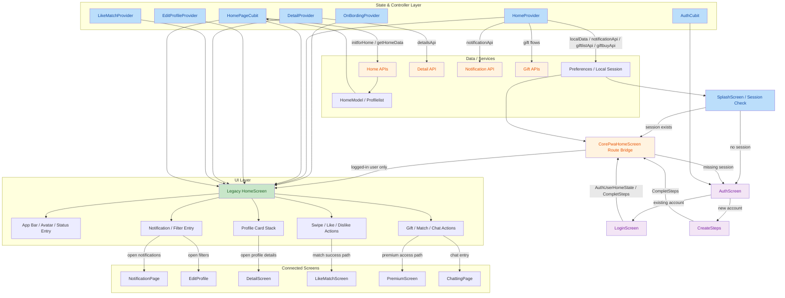

# HomeScreen Component

## Purpose

`HomeScreen` is the pre-developed discovery surface for the dating application. It is responsible for:

- loading home feed data from the backend,
- presenting profile discovery cards,
- handling primary profile actions such as like, dislike, open-details, chat, gifts, and filter access,
- coordinating entry into adjacent flows such as notifications, premium upsell, profile detail, and matches.

## Component Location

- Primary widget: `lib/presentation/screens/BottomNavBar/home_screen.dart`
- State provider: `lib/presentation/screens/BottomNavBar/homeProvider/homeprovier.dart`
- Data cubit: `lib/Logic/cubits/Home_cubit/home_cubit.dart`
- Data model: `lib/data/models/homemodel.dart`

## Current Feature Set

- App-bar greeting with user avatar and notification/filter actions
- Home feed loading using `HomePageCubit`
- Empty-state handling when no profiles are available
- Profile preview stack with swipe actions
- Detailed profile card presentation with match ratio, premium badge, bio, and distance
- Gift action flow
- Direct chat entry action when enabled
- Match detection handoff to `LikeMatchScreen`
- Filter handoff to edit-profile preferences

## Technical Architecture

### Widget Architecture

`HomeScreen` is a `StatefulWidget` driven by:

- `HomePageCubit` for async home-feed loading and like/dislike requests
- `HomeProvider` for local view state, animation state, filter state, notification state, and supporting API calls
- `EditProfileProvider` for filter metadata preload
- `OnbordingCubit` for shared app configuration and lookup lists
- `DetailProvider` for profile detail loading before navigation

### Data Flow

1. `initState()` triggers home initialization and supporting lookup preload.
2. `HomePageCubit.initforHome()` resolves session location and user ID.
3. `HomePageCubit.getHomeData()` requests `/home_data.php`.
4. `HomeCompleteState` renders the discovery UI.
5. User actions dispatch:
   - detail loading via `DetailProvider`
   - like/dislike via `HomePageCubit.profileLikeDislikeApi()`
   - notification loading via `HomeProvider.notificationApi()`
   - gift flow via `HomeProvider.giftbuyApi()`

## Flow Diagram

The diagram below documents the current HomeScreen architecture, including authentication handoff, session restore, route bridging, state-management wiring, API/data flow, and navigation connections across the home system.

### Diagram Notes

- `CorePwaHomeScreen` is retained only as a route bridge so the existing authentication flow remains unchanged.
- Logged-in users are redirected from that bridge into the legacy `HomeScreen`.
- `HomeScreen` remains the single authenticated home destination and keeps its existing status, detail, notification, gift, and match-related paths active.

## State Management Logic

### Global Dependencies

The HomeScreen path now expects these app-level registrations:

- `HomePageCubit`
- `EditProfileCubit`
- `MatchCubit`
- `PremiumBloc`
- `HomeProvider`
- `EditProfileProvider`
- `DetailProvider`
- `LikeMatchProvider`
- `PremiumProvider`
- `ByCoinProvider`
- `ChattingProvider`
- `ChatServices`

These were added to the root app provider tree so `HomeScreen` and its linked routes can mount without `ProviderNotFoundException` or missing bloc errors.

### Local UI State

`HomeProvider` controls:

- current profile index
- current carousel image index
- swipe animation controller and slide offset
- filter selections
- gift dialog selection state
- notification loading state

## Prop Validation Schema

### Widget Input Contract

`HomeScreen` does not accept runtime constructor props beyond the optional Flutter `key`.

### Required Runtime Preconditions

For correct operation, the following conditions must be true at runtime:

- a valid logged-in user session exists in local storage,
- `OnBordingProvider` already contains user latitude and longitude,
- `HomeProvider.localData()` has resolved user-local data,
- the backend home API returns a valid `HomeModel`.

### Defensive Handling Added

The issue-resolution pass added defensive handling for:

- empty or missing profile image lists,
- null or empty user avatar values,
- empty user names,
- null or invalid match-ratio values,
- current index drift after home-feed refresh.

## Integration Points

### Internal Navigation

The HomeScreen path integrates with:

- `NotificationPage`
- `EditProfile`
- `DetailScreen`
- `LikeMatchScreen`
- `PremiumScreen`
- `ChattingPage`

### APIs

The HomeScreen path integrates with:

- `/home_data.php`
- `/like_dislike.php`
- `/filter.php`
- `/u_notification_list.php`
- `/gift_list.php`
- `/giftbuy.php`
- `/profile_info.php`
- `/user_info.php`

## Styling Specifications

The component follows the shared design system from `lib/core/ui.dart`:

- primary brand color: `AppColors.appColor`
- light and dark surface colors from shared theme tokens
- shared `headline*`, `body*`, and `title*` text styles
- card and border colors from `AppColors.white`, `AppColors.darkContainer`, and `AppColors.borderColor`

### Layout Characteristics

- full-screen stacked profile presentation
- rounded profile-card corners
- gradient overlays for profile readability
- horizontally aligned floating action controls
- text truncation for long names, bios, and distances

## Accessibility Status

### Current Status

Accessibility is partially supported through Flutter semantics, but the current HomeScreen is not fully accessibility-hardened.

### Observations

- text contrast generally follows the design system and remains readable
- tappable areas are visually clear
- there are no explicit semantic labels on several icon-only interactive controls
- there is no keyboard-navigation-specific optimization for desktop web interaction

### Recommendation

Future hardening should add:

- semantic labels for icon-only buttons,
- more explicit focus handling for desktop and browser users,
- accessibility review for swipe-only actions and dialog flows.

## Performance Audit Notes

### Findings

- the HomeScreen renders large image cards and nested stacks, which is expected for the discovery flow
- profile-image assumptions previously caused crash-prone render paths when image lists were empty
- ad bootstrap and client-side token bootstrap introduced avoidable startup/runtime risk

### Optimizations Applied

- disabled out-of-scope ad bootstrap in the HomeScreen recovery pass
- disabled client-side Firebase access-token bootstrap in HomeScreen startup
- added safe empty-image fallback rendering instead of crashing on `.first`
- added safe match-ratio calculation instead of parsing from string fragments

## Debugging Instructions

### Useful Entry Files

- `lib/presentation/screens/BottomNavBar/home_screen.dart`
- `lib/presentation/screens/BottomNavBar/homeProvider/homeprovier.dart`
- `lib/Logic/cubits/Home_cubit/home_cubit.dart`
- `lib/data/models/homemodel.dart`
- `lib/core/routes.dart`
- `lib/main.dart`

### Debug Checklist

1. Confirm root providers are registered in `main.dart`.
2. Confirm named routes exist in `core/routes.dart`.
3. Confirm local session data is present via `Preferences.fetchUserDetails()`.
4. Confirm `OnBordingProvider.lat` and `OnBordingProvider.long` are available.
5. Confirm `/home_data.php` returns valid `profilelist` data.
6. Confirm profile images are non-empty or fall back to placeholder rendering.
7. Confirm notification, detail, and chat flows have their required providers.

## Browser / Runtime Validation

### Local Validation Completed

- Flutter analysis completed successfully.
- Flutter web build completed successfully.
- Generated web build was served locally and loaded in the browser.
- Fresh browser verification confirmed the app renders and reaches the initial onboarding screen without fatal runtime errors.
- Post-login and session-restore handoff remain unchanged at the auth layer and still target `CorePwaHomeScreen`.
- `CorePwaHomeScreen` now acts only as a session-aware bridge that routes logged-in users exclusively into the legacy `HomeScreen`.

### Scope Note

This verification confirms build integrity and browser render integrity for the current integrated app state. It does not replace dedicated QA on separate staging and production environments with real release infrastructure and browser matrix coverage.

## Changelog

### Issue-Resolution Pass

- Added missing root bloc registrations for Home-related flows.
- Added missing root providers for Home-related flows.
- Added missing named routes used by HomeScreen and adjacent navigation flows.
- Preserved the existing authentication flow targets by keeping `CorePwaHomeScreen` as the auth/session landing route.
- Converted `CorePwaHomeScreen` into a compatibility redirect that forwards logged-in users exclusively into the legacy `HomeScreen`.
- Reworked `FirebaseAuthService` to lazily access Firestore so app startup no longer trips on web-incompatible initialization.
- Reworked `ChatServices` to lazily access Firestore and safely no-op when Firebase is unavailable.
- Disabled out-of-scope Google Ads bootstrap in `HomeScreen`.
- Disabled out-of-scope client-side Firebase access-token bootstrap in `HomeScreen`.
- Added safe avatar fallback logic.
- Added safe profile-image fallback rendering.
- Added safe match-ratio calculation.
- Added defensive detail-opening logic to avoid user-session race failures.

## Maintenance Notes

- Do not re-enable Google Ads or client-side Firebase service-account token logic inside `HomeScreen` without a separate platform-safe implementation.
- Prefer server-side token issuance for protected Firebase operations.
- Keep all HomeScreen-linked routes registered together with their provider tree to avoid future runtime regressions.
