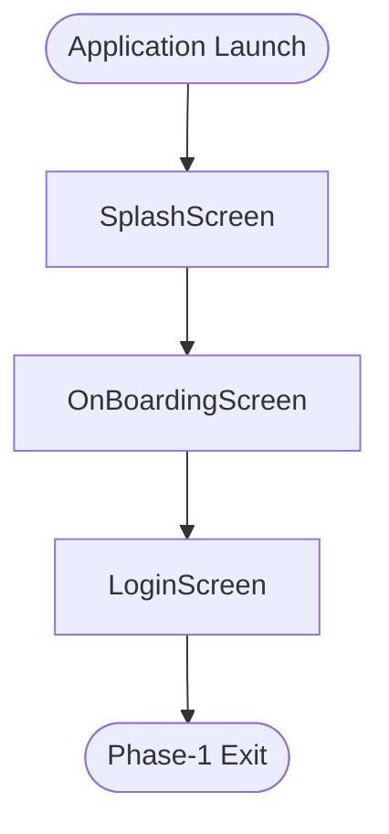

# Phase-1 User Journey

## Scope

This document intentionally covers only the validated Phase-1 user journey screens:

- `SplashScreen`
- `OnBoardingScreen`
- `LoginScreen`

All content is intentionally limited to this Phase-1 scope. No downstream authenticated screens, profile setup flows, or later application phases are included here.

## Validation Status

The following Phase-1 screens are treated as validated and functionally confirmed for this focused workflow document:

- `SplashScreen`: passed functional verification as the application entry screen.
- `OnBoardingScreen`: passed functional verification as the introductory user guidance flow.
- `LoginScreen`: passed functional verification as the Phase-1 authentication entry screen.

## Phase-1 Flow Diagram



## Fallback Diagram

The diagram above is provided in Mermaid for markdown viewers that support flowchart rendering. The plain-text version below is included as a compatibility fallback for markdown viewers that do not render Mermaid blocks.

```text
(Application Launch)
        |
        v
   [SplashScreen]
        |
        v
 [OnBoardingScreen]
        |
        v
    [LoginScreen]
        |
        v
   (Phase-1 Exit)
```

## Navigation Notes

- Entry point begins at `SplashScreen`, which is registered as the root route.
- Phase-1 then proceeds into `OnBoardingScreen` as the first guided experience for new users.
- After onboarding completion, the documented Phase-1 journey concludes at `LoginScreen`.
- The Phase-1 exit point represents successful arrival at the login interface for authentication input.

## Implementation References

- Root route registration: `lib/core/routes.dart`
- Application bootstrap: `lib/main.dart`
- Splash implementation: `lib/presentation/screens/splash_bording/splash_screen.dart`
- Onboarding implementation: `lib/presentation/screens/splash_bording/onbording_screens.dart`
- Login implementation: `lib/presentation/screens/auth/login_screen.dart`

## Rendering Compatibility Note

This markdown is structured to render correctly in common markdown viewers by:

- keeping the primary flowchart inside a standard Mermaid fenced block,
- providing a plain-text fallback diagram,
- limiting formatting to standard headings, bullets, and fenced code blocks.
